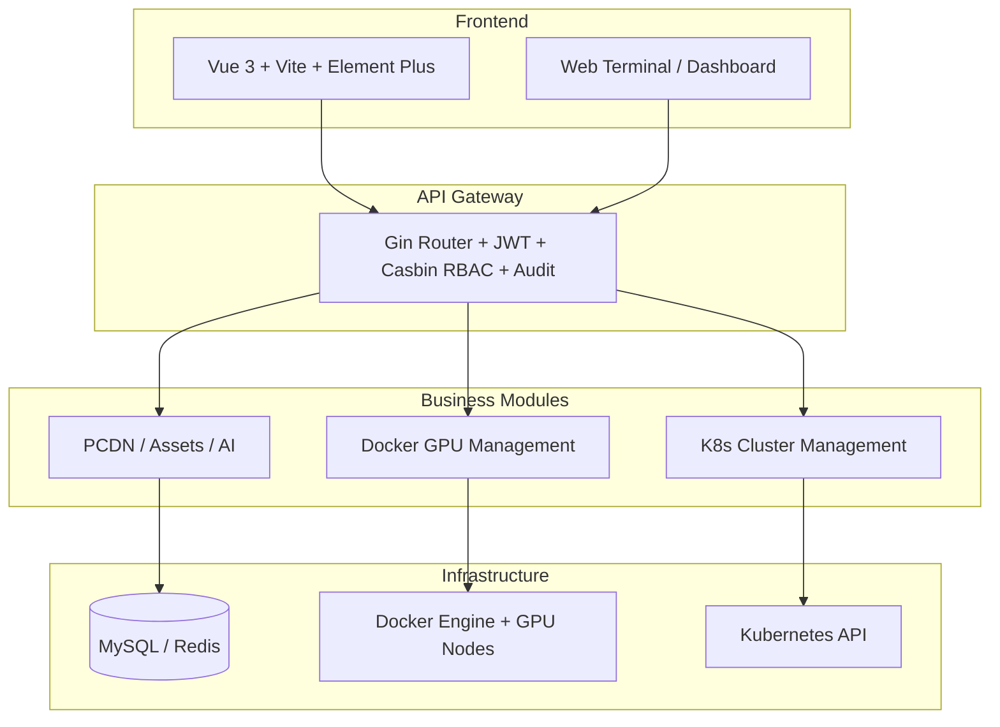

[简体中文](README.md) | [English](README.en.md)

# TianQi Compute Management Platform (Docker GPU Manage)

An enterprise-grade Docker GPU compute resource management platform: it onboards distributed GPU servers as compute nodes and provisions GPU container instances on demand, covering the full lifecycle from creation and connection to monitoring and recycling.


## 📖 Introduction

As demand grows for AI training, inference, and scientific computing, GPUs have become scarce and expensive. Traditional management approaches suffer from coarse-grained allocation and low utilization, no unified console for multi-node environments, weak permission and audit capabilities, and heavy manual work for container provisioning, monitoring, and maintenance.

Built on the Gin-Vue-Admin scaffold with a decoupled frontend/backend architecture, this platform registers GPU servers as compute nodes (connected remotely via the Docker API with TLS support) and creates container instances from a combination of image registry, product spec, and node. It ships with an SSH jump box, web terminal, port forwarding, and resource monitoring, plus Kubernetes multi-cluster management, PCDN node management, server/Dell asset management, and AI Agent and model fine-tuning extension modules.

It fits: AI/ML training and inference compute pools, scientific computing platforms, enterprise internal GPU resource management, cloud providers' GPU container services, and university teaching labs.

## ✨ Features

**Docker GPU Management**
- 🐳 Full container instance lifecycle: create, start, stop, restart, delete, with automatic cleanup of mounted volumes on deletion
- 🖥️ Compute node management: multi-node onboarding, Docker API over TLS, automatic connectivity checks
- 📦 Image registry management: multiple image sources with a VRAM-splitting support flag
- 💰 Product spec management: specs priced by GPU model/count/VRAM, CPU, memory, and disk, including GPU-less (GPU=0) specs
- ⚡ HAMi VRAM splitting: mounts the HAMi-core directory into `/libvgpu/build` and injects `LD_PRELOAD`, `CUDA_DEVICE_MEMORY_LIMIT`, `CUDA_DEVICE_SM_LIMIT`
- 🎯 Smart host matching: picks the best node by GPU/VRAM/CPU/memory/disk requirements and shows per-card available VRAM
- 🔐 SSH jump box: system account password auth, interactive container selection with direct connection, adaptive terminal size
- 💻 Web terminal: operate containers directly in the browser (bash/sh)
- 🔁 Port forwarding: TCP/UDP rules, enable/disable toggles, batch deletion, auto-detected local IPs, live connection status
- 📊 Resource monitoring: CPU, memory, GPU VRAM usage, network I/O, block I/O, process count, auto-refresh every 5s while running
- ⏰ Scheduled job: syncs node Docker connectivity and container state every 30 seconds

**Kubernetes Cluster Management**
- ☸️ Multi-cluster management: kubeconfig stored with AES-256-GCM encryption, connection pool with auto cleanup
- 📦 Workload management: Deployment / StatefulSet / DaemonSet with scaling and rolling restarts
- 🐙 Pod management: list, detail, logs, WebShell terminal, auto-refresh
- 🤖 AI diagnosis: correlates Pod status, events, and logs, and asks the AI Agent for root cause and fix suggestions
- 🧩 Namespace / Service / Event / Node management, plus cluster/node/pod metrics
- 🔑 Three-level RBAC (global/cluster/namespace) and operation audit logs

**PCDN Distributed Scheduling**
- 🌐 Unified management of edge/core nodes: online status, IP/MAC, OS version monitoring
- 📈 Bandwidth, storage usage, and daily/cumulative revenue statistics (smart scheduling planned)

**Ops Asset Management**
- 🖥️ Server lifecycle: asset registration → service deployment → decommission → scrap, fully closed-loop
- 🖴️ Dell server assets: service tag, rack/U position, warranty, department ownership, statistics dashboard

**System & AI Capabilities**
- 👥 Casbin-based RBAC
- 📢 Announcements: rich text + attachments, shown automatically after login
- 📧 Email service: SMTP / SSL with automatic alerting on system errors
- 🤖 AI Agent: Zhipu GLM model family, multi-session management, token usage stats, masked API key management
- 🧠 Model fine-tuning: task management for LLaMA and other LLMs, preset training templates, GPU device selection, progress and log tracking
- 🔌 MCP support: built-in GVA Helper MCP service (SSE) for AI-assisted development

## 🛠 Tech Stack

| Layer | Technologies |
|---|---|
| Backend | Go 1.25, Gin 1.10, GORM 1.25, Casbin v2, JWT v5, Zap, Viper, GoFrame gcron, gorilla/websocket |
| Container/Cluster | Docker SDK v27 (TLS), k8s.io/client-go v0.35 |
| Frontend | Vue 3.5, Vite 6, Element Plus 2.10, Pinia 2, Vue Router 4, Axios 1.8 |
| Database | MySQL (default), also PostgreSQL / SQLite / MSSQL / Oracle via GORM; optional Redis |
| Deployment | Docker, Docker Compose, Kubernetes |

## 🚀 Quick Start

### Requirements

- Go 1.25+, Node.js 20+, MySQL 5.7+ (or SQLite and other GORM-supported databases), Docker

### Option 1: Local Development

```bash
git clone https://github.com/hequan2017/docker-gpu-manage
cd docker-gpu-manage
\mv server/config.yaml.bak server/config.yaml

# Start the backend (port 8890 by default)
cd server
go mod download
go run main.go

# Start the frontend (port 8080 by default, /api proxied to the backend)
cd web
npm install        # or pnpm install
npm run dev        # or pnpm dev
```

Open `http://localhost:8080` and follow the guided database initialization (a default admin `admin` / `123456` is created afterwards — change the password on first login).

Useful endpoints: Swagger `http://127.0.0.1:8890/swagger/index.html`; MCP (SSE) `http://127.0.0.1:8890/sse`.

### Option 2: Docker Compose

```bash
cd deploy/docker-compose
# Adjust database settings in docker-compose.yaml if needed
docker-compose up -d
docker-compose ps
```

MySQL is mapped to `13306`, Redis to `16379`, and the frontend to `8080`; finish database initialization through the web UI after startup.

### Option 3: Kubernetes

```bash
cd deploy/kubernetes
kubectl apply -f server/
kubectl apply -f web/
```

### Key Configuration (server/config.yaml)

```yaml
system:
  db-type: mysql        # database type
  addr: 8890            # backend listen port
  use-redis: false      # recommended in production

jumpbox:
  enabled: true         # enable the SSH jump box
  port: 2026            # SSH listen port
  server-ip: "x.x.x.x"  # externally reachable jump box address
  host-key: ""          # auto-generated when empty

jwt:
  signing-key: your-key # must be changed in production
```

Frontend environment variables (`web/.env.*`): `VITE_BASE_API` (request prefix, proxied by Vite in dev), `VITE_BASE_PATH`, `VITE_SERVER_PORT`, `VITE_CLI_PORT`, `VITE_FILE_API`.

### Optional Steps

- **VRAM splitting**: deploy [HAMi-core](https://github.com/Project-HAMi/HAMi-core) on the Docker node, then fill its build directory into the node's "HAMi-core directory" field (default `/root/HAMi-core/build`)
- **Plugin initialization**: most plugins initialize automatically on first start; if needed, run `server/plugin/{aiagent,k8smanager,dellasset,finetuning,portforward}/*_install.sql`
- **Build & tooling**: `make build-local` for local packaging, `make doc` to generate Swagger, `make plugin PLUGIN=<name>` to package a plugin

## 📁 Directory Structure

```text
├── server/                # Go backend
│   ├── api/v1/ model/ service/ router/
│   ├── service/jumpbox/   # SSH jump box service
│   └── plugin/            # portforward, k8smanager, dellasset, aiagent,
│                          # finetuning, pcdn, server_lifecycle, announcement, etc.
├── web/                   # Vue 3 frontend (src/view + src/plugin)
├── deploy/                # docker / docker-compose / kubernetes
├── docs/                  # screenshots and wiki docs
├── website/               # project website (static pages)
└── wiki/                  # per-module usage guides
```

## 📸 Screenshots


## 🏗️ Architecture



## 🌐 Website

The project website lives at [website/index.html](./website/index.html). Preview locally:

```bash
cd website
python3 -m http.server 8000
# open http://localhost:8000
```

## 🔗 Related Projects

Evolutions in the same direction — pick whichever fits your needs:

- [kapigpu](https://github.com/hequan2017/kapigpu) — KaPi GPU management platform (lightweight GVA-based edition with Docker cluster credential management)
- [pcfarm-admin](https://github.com/hequan2017/pcfarm-admin) — server provisioning system covering assets, IP pools, PXE, and remote power control
- [tianqi](https://github.com/hequan2017/tianqi) — TianQi GPU Manager (with ModelScope Swift training and vLLM inference)
- [DockerGPU](https://github.com/hequan2017/DockerGPU) — the previous-generation GPU rental management system

## 📄 License

Released under the [Apache-2.0](./LICENSE) license.
