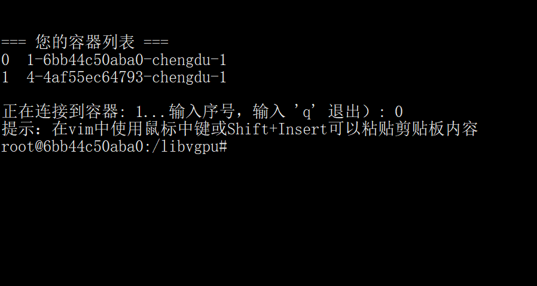
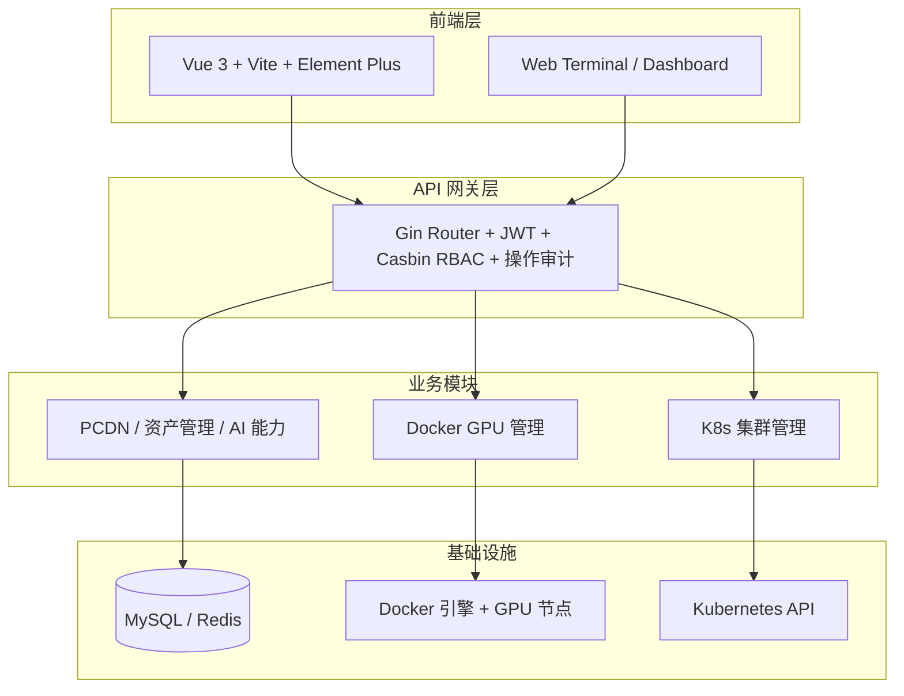

[简体中文](README.md) | [English](README.en.md)

# 天启算力管理平台（Docker GPU Manage）

企业级 Docker GPU 算力资源管理平台：把分散的 GPU 服务器纳管为算力节点，按规格一键创建 GPU 容器实例，覆盖创建、连接、监控、回收的全生命周期。


## 📖 项目介绍

随着 AI 训练、推理和科学计算的需求增长，GPU 成为稀缺且昂贵的资源。传统管理方式普遍存在几个痛点：资源切分粗、利用率低；多节点环境缺乏统一管理界面；权限与审计能力弱；容器创建、监控、维护依赖大量人工操作。

本平台基于 Gin-Vue-Admin 脚手架构建，采用前后端分离架构，把 GPU 服务器注册为算力节点（通过 Docker API 远程连接，支持 TLS），将镜像库、产品规格、算力节点组合创建容器实例，并提供 SSH 跳板机、Web 终端、端口转发、资源监控等配套能力；同时内置 Kubernetes 多集群管理、PCDN 节点纳管、服务器/戴尔资产管理，以及 AI Agent 和模型微调等扩展模块。

它适合：AI/ML 团队的训练推理算力池、科研机构计算平台、企业内部 GPU 资源统一管理、云服务商 GPU 容器化服务，以及高校教学实验环境。

## ✨ 功能特性

**Docker GPU 管理**
- 🐳 容器实例全生命周期：创建、启动、停止、重启、删除，删除时自动清理挂载的数据卷
- 🖥️ 算力节点管理：多节点纳管，Docker API 支持 TLS 安全连接，连接状态自动检测
- 📦 镜像库管理：多镜像源配置，支持标记是否支持显存切分
- 💰 产品规格管理：按 GPU 型号/数量/显存、CPU、内存、磁盘定义规格并定价，支持无显卡（GPU=0）规格
- ⚡ HAMi 显存切分：挂载 HAMi-core 目录到容器 `/libvgpu/build`，自动注入 `LD_PRELOAD`、`CUDA_DEVICE_MEMORY_LIMIT`、`CUDA_DEVICE_SM_LIMIT` 环境变量
- 🎯 智能主机匹配：按规格的 GPU/显存/CPU/内存/磁盘需求自动匹配最优节点，展示单卡可用显存
- 🔐 SSH 跳板机：系统账号密码认证，登录后交互式选择并直连自己的容器，终端窗口自适应
- 💻 Web 终端：浏览器内直接操作容器（bash/sh）
- 🔁 端口转发管理：TCP/UDP 规则、启用/禁用开关、批量删除、自动获取本机 IP、实时连接状态
- 📊 资源监控：CPU、内存、GPU 显存使用率、网络 I/O、块设备 I/O、进程数，运行中每 5 秒自动刷新
- ⏰ 定时任务：每 30 秒同步节点 Docker 连接状态与容器实际状态

**Kubernetes 集群管理**
- ☸️ 多集群管理：kubeconfig AES-256-GCM 加密存储，连接池自动清理
- 📦 工作负载管理：Deployment / StatefulSet / DaemonSet，支持扩缩容与滚动重启
- 🐙 Pod 管理：列表、详情、日志、WebShell 终端，支持自动刷新
- 🤖 AI 智能诊断：整合 Pod 状态、事件、日志，调用 AI Agent 分析故障并给出修复建议
- 🧩 Namespace / Service / Event / Node 管理，集群/节点/Pod 监控指标
- 🔑 三级 RBAC 权限（全局/集群/命名空间）与操作审计日志

**PCDN 分布式调度**
- 🌐 边缘/核心节点统一纳管：在线状态、IP/MAC、系统版本监控
- 📈 带宽、存储使用及每日/累计收益统计（智能调度规划中）

**运维资产管理**
- 🖥️ 服务器生命周期：资产登记 → 服务部署 → 下机 → 报废全流程闭环
- 🖴️ 戴尔物理服务器资产：服务标签、机柜/U 位、保修期、部门归属、统计仪表盘

**系统与 AI 能力**
- 👥 基于 Casbin 的 RBAC 权限管理
- 📢 系统公告：富文本 + 附件，登录后自动展示
- 📧 邮件服务：SMTP / SSL，系统异常自动告警
- 🤖 AI Agent：集成智谱 GLM 系列模型，多会话管理、Token 统计、API Key 脱敏管理
- 🧠 模型微调：LLaMA 等大模型微调任务管理，预设训练模板、GPU 设备选择、进度与日志跟踪
- 🔌 MCP 支持：内置 GVA Helper MCP 服务（SSE），可用 AI 工具辅助开发

## 🛠 技术栈

| 层 | 技术 |
|---|---|
| 后端 | Go 1.25、Gin 1.10、GORM 1.25、Casbin v2、JWT v5、Zap、Viper、GoFrame gcron、gorilla/websocket |
| 容器/集群 | Docker SDK v27（TLS）、k8s.io/client-go v0.35 |
| 前端 | Vue 3.5、Vite 6、Element Plus 2.10、Pinia 2、Vue Router 4、Axios 1.8 |
| 数据库 | MySQL（默认），兼容 PostgreSQL / SQLite / MSSQL / Oracle；Redis 可选 |
| 部署 | Docker、Docker Compose、Kubernetes |

## 🚀 快速开始

### 环境要求

- Go 1.25+、Node.js 20+、MySQL 5.7+（也可用 SQLite 等其他 GORM 支持的数据库）、Docker

### 方式一：本地开发

```bash
git clone https://github.com/hequan2017/docker-gpu-manage
cd docker-gpu-manage
\mv server/config.yaml.bak server/config.yaml

# 启动后端（默认 8890）
cd server
go mod download
go run main.go

# 启动前端（默认 8080，/api 代理到后端）
cd web
npm install        # 或 pnpm install
npm run dev        # 或 pnpm dev
```

访问 `http://localhost:8080`，按页面引导完成数据库初始化（初始化后自动创建默认管理员 `admin` / `123456`，首次登录请改密）。

常用地址：Swagger `http://127.0.0.1:8890/swagger/index.html`；MCP（SSE）`http://127.0.0.1:8890/sse`。

### 方式二：Docker Compose

```bash
cd deploy/docker-compose
# 可按需修改 docker-compose.yaml 中的数据库等配置
docker-compose up -d
docker-compose ps
```

MySQL 映射 `13306`，Redis 映射 `16379`，前端 `8080`；启动后同样通过页面引导初始化数据库。

### 方式三：Kubernetes

```bash
cd deploy/kubernetes
kubectl apply -f server/
kubectl apply -f web/
```

### 关键配置（server/config.yaml）

```yaml
system:
  db-type: mysql        # 数据库类型
  addr: 8890            # 后端监听端口
  use-redis: false      # 生产建议开启

jumpbox:
  enabled: true         # 是否启用 SSH 跳板机
  port: 2026            # SSH 监听端口
  server-ip: "x.x.x.x"  # 对外暴露的跳板机地址
  host-key: ""          # 留空则自动生成

jwt:
  signing-key: your-key # 生产环境务必修改
```

前端环境变量（`web/.env.*`）：`VITE_BASE_API`（请求前缀，开发模式由 Vite 代理）、`VITE_BASE_PATH`、`VITE_SERVER_PORT`、`VITE_CLI_PORT`、`VITE_FILE_API`。

### 可选步骤

- **显存切分**：在 Docker 节点上部署 [HAMi-core](https://github.com/Project-HAMi/HAMi-core)，并把实际 build 目录路径填到算力节点的"HAMi-core 目录"字段（默认 `/root/HAMi-core/build`）
- **插件初始化**：大部分插件首次启动自动初始化，必要时可执行 `server/plugin/{aiagent,k8smanager,dellasset,finetuning,portforward}/*_install.sql`
- **构建与工具**：`make build-local` 本地打包、`make doc` 生成 Swagger、`make plugin PLUGIN=插件名` 打包插件

## 📁 目录结构

```text
├── server/                # Go 后端
│   ├── api/v1/ model/ service/ router/
│   ├── service/jumpbox/   # SSH 跳板机服务
│   └── plugin/            # portforward、k8smanager、dellasset、aiagent、
│                          # finetuning、pcdn、server_lifecycle、announcement 等
├── web/                   # Vue 3 前端（src/view + src/plugin）
├── deploy/                # docker / docker-compose / kubernetes
├── docs/                  # 截图与 Wiki 文档
├── website/               # 项目官网（纯静态页面）
└── wiki/                  # 各模块使用说明
```

## 📸 系统截图




## 🏗️ 系统架构


```mermaid
graph TB
    subgraph "前端层"
        A1[Vue 3 + Vite + Element Plus]
        A2[Web Terminal / Dashboard]
    end
    subgraph "API 网关层"
        B1[Gin Router + JWT + Casbin RBAC + 操作审计]
    end
    subgraph "业务模块"
        C1[Docker GPU 管理]
        C2[K8s 集群管理]
        C3[PCDN / 资产管理 / AI 能力]
    end
    subgraph "基础设施"
        G1[(MySQL / Redis)]
        G3[Docker 引擎 + GPU 节点]
        G4[Kubernetes API]
    end
    A1 --> B1
    A2 --> B1
    B1 --> C1
    B1 --> C2
    B1 --> C3
    C1 --> G3
    C2 --> G4
    C3 --> G1
```

## 🌐 官方网站

项目官网位于 [website/index.html](./website/index.html)，本地预览：

```bash
cd website
python3 -m http.server 8000
# 浏览器访问 http://localhost:8000
```

## 🔗 相关项目

同一方向的演进版本，欢迎按需选用：

- [kapigpu](https://github.com/hequan2017/kapigpu) — 卡皮巴拉 GPU 管理平台（基于 GVA 的轻量版，Docker 集群凭证管理）
- [pcfarm-admin](https://github.com/hequan2017/pcfarm-admin) — 面向装机网段的服务器资产 / IP / PXE / 远控管理系统
- [tianqi](https://github.com/hequan2017/tianqi) — TianQi GPU Manager（含 ModelScope Swift 训练与 vLLM 推理）
- [DockerGPU](https://github.com/hequan2017/DockerGPU) — 前代 GPU 算力租用管理系统

## 📄 License

本项目基于 [Apache-2.0](./LICENSE) 协议开源。
