# 天启算力管理平台

## 📖 项目介绍

**Docker GPU 算力资源管理平台** 是一个企业级的 GPU 容器化资源管理和调度系统，旨在帮助组织高效、安全地管理和分配 GPU 算力资源。平台采用现代化的微服务架构，提供从资源管理到容器实例全生命周期的完整解决方案。


### 🚀 项目图片


### 🎯 项目目标

随着人工智能、深度学习、科学计算等领域的快速发展，GPU 算力资源已成为稀缺且昂贵的计算资源。传统的 GPU 资源管理方式存在以下痛点：

- **资源利用率低**：GPU 资源分配不灵活，难以实现细粒度的资源切分和共享
- **管理成本高**：多节点、多 GPU 环境下的资源管理复杂，缺乏统一的管理界面
- **安全性不足**：缺乏完善的权限控制和访问审计机制
- **运维效率低**：容器创建、监控、维护等操作需要大量人工干预

本平台致力于解决上述问题，提供：

✅ **统一的资源管理**：集中管理多个 GPU 算力节点，实现资源的统一调度和分配  
✅ **灵活的资源配置**：支持 GPU 显存切分，实现更细粒度的资源分配，提高资源利用率  
✅ **完整的生命周期管理**：从容器创建到删除的全流程自动化管理  
✅ **安全可靠的访问控制**：基于 RBAC 的权限管理，支持 SSH 跳板机和 Web 终端  
✅ **实时监控与运维**：容器状态自动同步、资源使用率实时监控、日志查看等运维功能  

### 🌟 核心特色

1. **智能资源匹配**：根据产品规格的 GPU 需求、显存需求、CPU、内存、磁盘等资源进行智能匹配，自动选择最优算力节点
2. **显存切分支持**：支持 HAMi 显存切分技术，可以将单块 GPU 的显存切分为多个虚拟 GPU，实现更灵活的资源配置
3. **多节点管理**：支持管理多个分布式 GPU 算力节点，支持 TLS 安全连接，自动检测节点状态
4. **SSH 跳板机服务**：提供安全的 SSH 跳板机功能，用户可以通过 SSH 连接跳板机后选择并连接到自己的容器实例
5. **Web 终端集成**：内置 Web 终端功能，无需额外工具即可在浏览器中直接操作容器
6. **实时资源监控**：提供 CPU、内存、网络 I/O、块设备 I/O、进程数等实时监控指标
7. **自动化运维**：定时任务自动检查容器状态，保持数据同步，减少人工干预

### 🎨 应用场景

- **AI/ML 训练平台**：为机器学习团队提供按需的 GPU 容器实例，支持模型训练和推理
- **科研计算平台**：为科研机构提供 GPU 算力资源池，支持科学计算、仿真等任务
- **云服务提供商**：为云服务商提供 GPU 容器化服务的基础平台
- **企业内部算力管理**：帮助企业统一管理内部 GPU 资源，提高资源利用率和运维效率
- **教育机构**：为高校和培训机构提供 GPU 教学实验环境

### 🚀 技术亮点

- **前后端分离架构**：采用 Gin + Vue3 的现代化技术栈，前后端完全分离，便于开发和维护
- **微服务设计**：模块化设计，各功能模块独立，易于扩展和维护
- **安全可靠**：支持 Docker TLS 安全连接，基于 RBAC 的权限控制，SSH 跳板机安全访问
- **高性能**：基于 Go 语言开发，性能优异，支持高并发场景
- **易于部署**：提供 Docker 和 Kubernetes 部署方案，支持一键部署

### 核心功能

**Docker GPU 管理：**
- 🐳 **容器实例管理**：创建、启动、停止、重启、删除 GPU 容器实例，支持自动删除挂载数据卷
- 🖥️ **算力节点管理**：管理多个 GPU 算力节点，支持 TLS 安全连接，自动测试 Docker 连接状态
- 📦 **镜像库管理**：统一管理 Docker 镜像仓库，支持显存切分配置
- 💰 **产品规格管理**：定义 GPU 产品规格和定价，支持无显卡规格（GPU=0）和显存切分
- 🔁 **端口转发管理**：管理端口转发规则，支持 TCP/UDP 协议，实时连接状态监控，实现灵活的端口映射
- 🔐 **SSH 跳板机**：通过 SSH 安全连接到容器实例
- 💻 **Web 终端**：在浏览器中直接操作容器
- 📊 **资源监控**：实时查看容器状态、日志、CPU/内存使用率、网络 I/O、块设备 I/O、进程数

**Kubernetes 集群管理：**
- ☸️ **集群管理**：添加、编辑、删除多个 K8s 集群，支持 kubeconfig 加密存储
- 📦 **工作负载管理**：管理 Deployment、StatefulSet、DaemonSet 等工作负载
- 🐳 **Pod 管理**：查看 Pod 列表、详情、日志，支持自动刷新
- 🌐 **Service 管理**：管理集群服务，查看端点信息
- 📊 **监控指标**：收集集群、节点、Pod 的资源使用指标
- 🔐 **权限控制**：基于 RBAC 的多级权限管理（全局/集群/命名空间）
- 📝 **操作审计**：记录所有 K8s 操作日志，支持审计追溯

**系统功能：**
- 👥 **权限管理**：基于角色的访问控制（RBAC）
- ⚡ **显存切分**：支持GPU显存切分，更灵活地分配GPU资源
- ⏰ **定时任务**：自动检查容器状态，保持数据同步
- 🖴️ **戴尔资产管理**：物理服务器资产全生命周期管理
- 🤖 **AI Agent**：集成智谱GLM-4.7模型，提供智能对话和AI辅助功能
- 🧠 **模型微调**：支持LLaMA等大模型的微调任务管理，提供完整的训练流程控制

### 功能模块

#### 1. 镜像库管理
管理 Docker 镜像仓库信息，支持多镜像源配置。

| 字段 | 类型 | 必填 | 说明 |
|------|------|------|------|
| 名字 | string | ✅ | 镜像库名称 |
| 地址 | string | ✅ | 镜像库地址 |
| 描述 | string | | 镜像库描述 |
| 来源 | string | | 镜像库来源 |
| 是否支持显存切分 | bool | ✅ | 默认否，是否支持GPU显存切分 |
| 是否上架 | bool | ✅ | 默认上架 |
| 备注 | string | | 备注信息 |

#### 2. 算力节点管理
管理 GPU 算力节点，支持 Docker TLS 安全连接，自动测试 Docker 连接状态。

| 字段 | 类型 | 必填 | 说明 |
|------|------|------|------|
| 名字 | string | ✅ | 节点名称 |
| 区域 | string | | 节点区域 |
| CPU | string | | CPU 信息 |
| 内存 | string | | 内存信息 |
| 系统盘容量 | string | | 系统盘大小 |
| 数据盘容量 | string | | 数据盘大小 |
| IP地址公网 | string | ✅ | 公网 IP |
| IP地址内网 | string | ✅ | 内网 IP |
| SSH端口 | int | ✅ | 默认 22 |
| 用户名 | string | | SSH 用户名 |
| 密码 | string | | SSH 密码 |
| 显卡名称 | string | | GPU 型号 |
| 显卡数量 | int | | GPU 数量 |
| 显存容量 | int | | 单卡显存容量(GB) |
| HAMi-core目录 | string |  | 节点HAMi-core build目录路径，用于显存切分挂载，示例：/root/HAMi-core/build |
| Docker连接地址 | string | | Docker API 地址 |
| 使用TLS | bool | | 默认启用 |
| CA证书 | text | | TLS CA 证书 |
| 客户端证书 | text | | TLS 客户端证书 |
| 客户端私钥 | text | | TLS 客户端私钥 |
| Docker状态 | string | | 自动测试（connected/failed/unknown） |
| 是否上架 | bool | ✅ | 默认上架 |
| 备注 | string | | 备注信息 |

**功能特性：**
- ✅ 创建或更新节点时自动测试 Docker TCP 连接
- ✅ 实时显示 Docker 连接状态（已连接/连接失败/未知）
- ✅ 支持 TLS 和非 TLS 连接测试

#### 3. 产品规格管理
定义 GPU 算力产品规格和定价，支持无显卡规格（CPU 容器）。

| 字段 | 类型 | 必填 | 说明 |
|------|------|------|------|
| 名称 | string | ✅ | 规格名称 |
| 显卡型号 | string | | GPU 型号（GPU=0 时可为空） |
| 显卡数量 | int | | GPU 数量（0 表示无显卡） |
| 显存容量(GB) | int | | 显存容量 |
| 是否支持显存切分 | bool | ✅ | 默认否，是否支持GPU显存切分 |
| CPU核心数 | int | | CPU 核心数 |
| 内存(GB) | int | | 内存大小 |
| 系统盘容量(GB) | int | | 系统盘大小 |
| 数据盘容量(GB) | int | | 数据盘大小 |
| 价格/小时 | float64 | | 每小时价格 |
| 是否上架 | bool | ✅ | 默认上架 |
| 备注 | string | | 备注信息 |

**功能特性：**
- ✅ 支持无显卡规格（GPU=0），创建容器时不挂载 GPU 参数
- ✅ 无显卡规格匹配节点时，不检查 GPU 型号和数量
- ✅ 所有节点都可以匹配无显卡规格（只要满足 CPU、内存、磁盘要求）
- ✅ 支持显存切分功能，可以更灵活地分配GPU显存资源
- ✅ 根据镜像和产品规格的显存切分支持情况，智能过滤可用规格
- ✅ 支持显存切分的产品规格创建容器时，自动添加HAMi显存切分相关参数

#### 4. 实例管理
管理 GPU 容器实例的完整生命周期，提供丰富的容器操作功能。

**数据字段：**

| 字段 | 类型 | 必填 | 说明 |
|------|------|------|------|
| 镜像 | 关联 | ✅ | 关联镜像库 |
| 产品规格 | 关联 | ✅ | 关联产品规格 |
| 用户 | 关联 | | 后端自动填写 |
| 算力节点 | 关联 | ✅ | 关联算力节点 |
| Docker容器ID | string | | 后端自动回填 |
| Docker容器名称 | string | | 后端自动回填（格式：名称-实例ID-时间戳） |
| 实例名称 | string | ✅ | 实例名称 |
| 容器状态 | string | | 后端自动填写（running/exited/creating/failed） |
| 备注 | string | | 备注信息 |

**支持操作：**

- **查看**：查看实例详细信息，包括资源使用率监控
- **SSH连接**：显示SSH连接命令，支持一键复制
- **启动**：启动已停止的容器
- **停止**：停止运行中的容器
- **重启**：重启容器实例
- **日志**：查看容器运行日志（支持实时刷新）
- **终端**：Web终端，在浏览器中直接操作容器（支持bash/sh）
- **删除**：删除实例和对应的容器，自动删除挂载的数据卷

**新增实例功能：**
- ✅ 智能主机匹配：根据产品规格的GPU需求、显存需求、CPU、内存、磁盘等资源进行智能匹配
- ✅ 显存切分支持：根据镜像的显存切分支持情况，自动过滤可用的产品规格
- ✅ 单卡显存显示：在选择主机时显示单卡可用显存大小，便于判断是否满足需求
- ✅ 实例名称校验：实例名称仅支持字母、数字、横线和下划线，不支持中文
- ✅ 资源分配优化：支持按卡分配显存，更精确地管理GPU资源
- ✅ 容器创建时如启用显存切分：从“算力节点”的 HAMi-core 目录字段读取路径，挂载到容器 /libvgpu/build，并自动注入 LD_PRELOAD、CUDA_DEVICE_MEMORY_LIMIT、CUDA_DEVICE_SM_LIMIT 环境变量；如未配置则使用默认路径 /root/HAMi-core/build

**资源监控：**
- ✅ **CPU使用率**：实时显示 CPU 使用百分比（进度条）
- ✅ **内存使用率**：实时显示内存使用百分比和详细使用量（进度条）
- ✅ **网络 I/O**：显示网络接收和发送字节数
- ✅ **块设备 I/O**：显示块设备读取和写入字节数
- ✅ **进程数**：显示当前容器进程数
- ✅ 自动刷新：容器运行时每 5 秒自动刷新统计信息
- ✅ 手动刷新：支持手动刷新按钮

**容器状态：**
- `creating`：创建中
- `running`：运行中
- `exited`：已停止
- `failed`：创建失败

**权限控制：**
- 普通用户：只能操作自己创建的实例
- 管理员：可以操作所有实例

**定时任务：**
- ✅ 单一合并任务：每30秒执行一次，顺序为 1) 检查所有算力节点的 Docker 连接状态并更新 DockerStatus（connected/failed）；2) 检查所有容器的运行状态并刷新 CPU/内存/GPU 显存使用率
- ✅ 状态自动同步：自动将 Docker 容器的实际状态同步到数据库
- ✅ 使用 gcron 定时任务框架（initialize/timer.go 内的 system-health-check），稳定可靠
- ✅ 日志优化：移除定时任务完成的汇总 Info 日志，仅保留必要的 Error/Warn 及少量 Debug 日志，降低控制台噪声

**数据卷管理：**
- ✅ 删除容器时自动删除所有挂载的命名数据卷
- ✅ 自动识别容器挂载的所有数据卷（不仅仅是默认的数据卷）
- ✅ 即使容器删除失败，也会尝试删除数据卷

#### 5. SSH跳板机服务
提供SSH跳板机功能，用户可以通过SSH连接跳板机，然后选择并连接到自己的容器实例。

**功能特性：**
- ✅ SSH密码认证（使用系统用户账号密码）
- ✅ 自动显示用户创建的容器列表
- ✅ 支持管理员查看所有容器
- ✅ 交互式容器选择
- ✅ 自动连接到选定的容器
- ✅ 终端窗口大小自动适配（支持vim等编辑器）
- ✅ 支持TLS和非TLS的Docker连接

**配置说明：**

在 `server/config.yaml` 中配置：

```yaml
jumpbox:
  enabled: true          # 是否启用SSH跳板机
  port: 2026            # SSH监听端口（默认2026）
  server-ip: "192.168.112.148"
  host-key: ""          # SSH主机密钥路径（可选，不设置则自动生成）
  banner: "欢迎使用SSH跳板机服务\r\n"  # SSH欢迎信息
```

**使用方法：**

1. **启动服务**
   - SSH跳板机服务会在后端服务启动时自动启动（如果enabled=true）
   - 默认监听端口：2026

2. **连接跳板机**
   ```bash
   ssh -p 2026 用户名@服务器IP
   # 例如：ssh -p 2026 admin@192.168.112.148
   ```

3. **认证登录**
   - 输入系统用户密码进行认证
   - 认证成功后显示容器列表

4. **选择容器**
   - 查看显示的容器列表（格式：序号 实例名称-容器ID-算力节点）
   - 输入序号选择要连接的容器
   - 输入 'q' 退出

5. **容器操作**
   - 连接成功后即可在容器内执行命令
   - 支持vim等编辑器，窗口大小自动适配
   - 在vim中使用 `Shift+Insert` 或鼠标中键可以粘贴剪贴板内容

**权限说明：**
- 普通用户：只能看到和连接自己创建的容器
- 管理员（authorityId=888）：可以看到和连接所有容器

**前端操作：**
- 在实例管理页面，点击"SSH连接"按钮
- 系统会显示SSH连接命令，支持一键复制

#### 6. 端口转发管理
提供端口转发规则管理功能，支持TCP/UDP协议的端口映射，自动获取本机IP地址，实现灵活的网络流量转发。

**功能特性：**
- ✅ 支持TCP和UDP协议
- ✅ 自动获取服务器所有非127.0.0.1的IP地址作为默认源IP
- ✅ 灵活的端口映射配置（源IP:端口 → 目标IP:端口）
- ✅ 启用/禁用状态切换，实时生效
- ✅ 批量删除支持，提高管理效率
- ✅ 多条件搜索过滤（源IP、协议类型、状态）
- ✅ 规则描述和备注信息，便于管理
- ✅ 直观的表格展示，一目了然

**字段说明：**

| 字段 | 类型 | 必填 | 说明 |
|------|------|------|------|
| 源IP地址 | string | ✅ | 监听的IP地址，默认自动获取本机IP |
| 源端口 | int | ✅ | 监听的端口号（1-65535） |
| 协议类型 | string | ✅ | TCP或UDP |
| 目标IP地址 | string | ✅ | 转发到的目标IP地址 |
| 目标端口 | int | ✅ | 转发到的目标端口（1-65535） |
| 状态 | bool | ✅ | 是否启用转发 |
| 规则描述 | string | | 规则说明信息 |

**前端界面功能：**

1. **搜索过滤**：
   - 按源IP地址搜索
   - 按协议类型过滤（TCP/UDP）
   - 按状态过滤（启用/禁用）

2. **操作功能**：
   - **新增**：创建新的端口转发规则，点击"获取服务器IP"按钮自动填充可用IP
   - **编辑**：修改现有转发规则配置
   - **删除**：单条删除或批量删除
   - **状态切换**：通过开关快速启用/禁用转发规则

3. **表格展示**：
   - 创建日期
   - 源地址（IP:端口）
   - 协议类型（带颜色标签）
   - 目标地址（IP:端口）
   - 状态（开关控制）
   - 操作按钮（编辑、删除）

**API接口：**

- `POST /api/portForward/createPortForward` - 创建端口转发规则
- `DELETE /api/portForward/deletePortForward` - 删除端口转发规则
- `DELETE /api/portForward/deletePortForwardByIds` - 批量删除端口转发规则
- `PUT /api/portForward/updatePortForward` - 更新端口转发规则
- `PUT /api/portForward/updatePortForwardStatus` - 更新规则状态
- `GET /api/portForward/findPortForward` - 根据ID获取规则
- `GET /api/portForward/getPortForwardList` - 获取规则列表（分页）
- `GET /api/portForward/getServerIP` - 获取服务器IP地址列表

**使用场景：**
- 🐳 **容器服务端口映射**：将容器内部端口映射到宿主机外部端口
- 🌐 **内网服务外网访问**：实现内网服务通过公网IP访问
- ⚖️ **负载均衡配置**：配合负载均衡器实现流量分发
- 🔀 **服务代理转发**：搭建服务代理，实现跨网络访问
- 🛡️ **安全访问控制**：通过端口转发限制特定服务的访问入口

**技术实现：**
- 后端插件：`server/plugin/portforward/`
- 前端插件：`web/src/plugin/portforward/`
- 数据模型：`PortForward` (model/port_forward.go)
- 初始化SQL：`portforward_install.sql`
- 自动获取本机所有网络接口的非回环IP地址
- 支持状态实时切换，无需重启服务
- 实时显示转发器运行状态和活跃连接数
- 支持自动刷新（5秒间隔）

#### 7. Kubernetes 集群管理
提供完整的 Kubernetes 集群管理功能，支持多集群统一管理，包含工作负载、服务、Pod 等资源的全生命周期管理。

**功能特性：**
- ✅ 多集群管理，支持添加、编辑、删除 K8s 集群
- ✅ Kubeconfig 加密存储（AES-256-GCM）
- ✅ 连接池管理，自动清理过期连接
- ✅ 工作负载管理（Deployment、StatefulSet、DaemonSet）
- ✅ Pod 管理（列表、详情、日志、自动刷新）
- ✅ Service 管理（列表、详情、端点查看）
- ✅ 监控指标收集（集群、节点、Pod 资源使用率）
- ✅ 基于角色的权限控制（RBAC）
- ✅ 操作审计日志

**集群配置：**

| 字段 | 类型 | 必填 | 说明 |
|------|------|------|------|
| 名称 | string | ✅ | 集群名称 |
| Kubeconfig | text | ✅ | K8s 集群配置（加密存储） |
| 描述 | string | | 集群描述 |
| 状态 | bool | ✅ | 是否启用 |

**工作负载操作：**

- **Deployment 管理**：
  - 列表查看（副本数、镜像、运行时间）
  - 详情查看（YAML、容器配置）
  - Pods 查看（关联的 Pod 列表）
  - 扩缩容（调整副本数）
  - 重启（滚动更新）
  - 删除

- **Pod 管理**：
  - 列表查看（状态、IP、节点、重启次数）
  - 详情查看（YAML、容器配置）
  - 日志查看（支持配置行数）
  - 终端连接（开发中）
  - 删除

- **Service 管理**：
  - 列表查看（类型、端口、端点）
  - 详情查看（YAML、端口配置）
  - 端点查看（NodePort、ClusterIP）
  - 删除

**监控指标：**
- 集群级别：节点总数、Pod 总数、资源使用率
- 节点级别：CPU、内存、磁盘使用率
- Pod 级别：CPU、内存使用率

**权限控制：**
- **全局权限**：管理所有集群的所有资源
- **集群权限**：管理指定集群的所有资源
- **命名空间权限**：管理指定集群的指定命名空间资源

**API接口：**

- `GET /k8s/cluster/list` - 获取集群列表
- `POST /k8s/cluster/create` - 创建集群
- `PUT /k8s/cluster/update` - 更新集群
- `DELETE /k8s/cluster/delete` - 删除集群
- `GET /k8s/deployment/list` - 获取 Deployment 列表
- `GET /k8s/deployment/detail` - 获取 Deployment 详情
- `POST /k8s/deployment/scale` - 扩缩容 Deployment
- `POST /k8s/deployment/restart` - 重启 Deployment
- `GET /k8s/pod/list` - 获取 Pod 列表
- `GET /k8s/pod/logs` - 获取 Pod 日志
- `GET /k8s/service/list` - 获取 Service 列表
- `GET /k8s/metrics/cluster` - 获取集群指标
- `GET /k8s/metrics/nodes` - 获取节点指标
- `GET /k8s/metrics/pods` - 获取 Pod 指标

**技术实现：**
- 后端插件：`server/plugin/k8smanager/`
- 前端插件：`web/src/plugin/k8smanager/`
- K8s 客户端：`k8s.io/client-go`
- 加密算法：AES-256-GCM
- 连接池：支持 TTL 和自动清理

#### 8. 戴尔物理服务器资产管理
提供完整的戴尔物理服务器资产全生命周期管理功能，支持服务器硬件配置、网络信息、物理位置、所属部门等多维度管理。

**功能特性：**
- ✅ 完整的硬件信息记录（CPU、内存、磁盘、网卡）
- ✅ 物理位置管理（机柜、机架U位）
- ✅ 服务标签（Service Tag）唯一标识
- ✅ 多维度搜索过滤
- ✅ 资产统计仪表盘
- ✅ 状态管理（在线/离线/维护中）
- ✅ 保修期管理
- ✅ 部门/负责人归属

**字段说明：**

| 字段 | 类型 | 必填 | 说明 |
|------|------|------|------|
| 主机名 | string | ✅ | 服务器名称 |
| 服务标签 | string | ✅ | 戴尔唯一标识符 |
| 资产编号 | string | | 资产编号 |
| 型号 | string | | 服务器型号 |
| 序列号 | string | | 序列号 |
| CPU型号 | string | | CPU型号 |
| CPU核心数 | int | | CPU核心数 |
| CPU线程数 | int | | CPU线程数 |
| 内存容量 | int | | 内存容量(GB) |
| 磁盘信息 | string | | 磁盘配置详情 |
| 网卡信息 | string | | 网卡配置详情 |
| IP地址 | string | | IP地址 |
| MAC地址 | string | | MAC地址 |
| 机柜位置 | string | | 机柜编号 |
| 机架位置 | string | | U位，如U5-U8 |
| 电源状态 | string | | online/offline |
| 购买日期 | date | | 购买日期 |
| 保修到期日 | date | | 保修到期日期 |
| 操作系统 | string | | 操作系统版本 |
| 所属部门 | string | | 部门名称 |
| 负责人 | string | | 负责人 |
| 状态 | string | | online/offline/maintenance |
| 备注 | text | | 备注信息 |

**前端功能：**
- 统计卡片：总数、在线、离线、维护中
- 搜索过滤：主机名、服务标签、IP地址、状态
- 多Tab表单：基本信息、硬件配置、网络与位置、其他信息
- 详情查看：完整的服务器资产信息展示
- 批量操作：多选删除

**API接口：**
- `POST /dellAsset/createDellAsset` - 创建资产
- `DELETE /dellAsset/deleteDellAsset` - 删除资产
- `DELETE /dellAsset/deleteDellAssetByIds` - 批量删除
- `PUT /dellAsset/updateDellAsset` - 更新资产
- `GET /dellAsset/findDellAsset` - 查询单个资产
- `GET /dellAsset/getDellAssetList` - 获取资产列表
- `GET /dellAsset/getStatistics` - 获取统计信息

**技术实现：**
- 后端插件：`server/plugin/dellasset/`
- 前端插件：`web/src/plugin/dellasset/`
- 数据表：`gva_dell_asset`
- 初始化SQL：`dellasset_install.sql`

#### 9. AI Agent 智能助手
集成智谱 GLM-4.7 模型，提供智能对话和 AI 辅助功能，支持多会话管理、实时对话和完整的会话历史记录。

**功能特性：**
- ✅ 多会话管理：创建、切换、删除对话会话
- ✅ 实时对话：与 AI 进行实时交流，支持上下文理解
- ✅ 会话历史：完整的对话历史记录，随时查看
- ✅ 模型配置：支持 GLM-4-Plus、GLM-4-Air、GLM-4-Flash、GLM-3-Turbo
- ✅ 参数调整：支持温度、最大Token数等参数配置
- ✅ Token 统计：实时显示 Token 使用情况
- ✅ API Key 管理：安全存储和管理智谱 AI 的 API Key
- ✅ 多配置支持：支持多个 AI 配置，可灵活切换

**数据模型：**

**会话表 (gva_aiagent_conversations)**

| 字段 | 类型 | 必填 | 说明 |
|------|------|------|------|
| 标题 | string | ✅ | 会话标题 |
| 用户ID | int | | 所属用户 |
| 模型 | string | ✅ | 使用的模型（默认glm-4-plus） |
| 系统提示词 | text | | 系统提示词 |
| 温度 | double | | 温度参数（默认0.7） |
| 最大Token数 | int | | 最大token数（默认4096） |
| 是否激活 | bool | ✅ | 是否激活 |

**消息表 (gva_aiagent_messages)**

| 字段 | 类型 | 必填 | 说明 |
|------|------|------|------|
| 会话ID | int | ✅ | 所属会话 |
| 角色 | string | ✅ | 角色（user/assistant/system） |
| 内容 | text | ✅ | 消息内容 |
| Token数量 | int | | Token统计 |
| 元数据 | json | | 元数据（finish_reason等） |

**配置表 (gva_aiagent_configs)**

| 字段 | 类型 | 必填 | 说明 |
|------|------|------|------|
| 配置名称 | string | ✅ | 配置名称（唯一） |
| API Key | string | ✅ | 智谱AI的API Key |
| API地址 | string | ✅ | API基础URL |
| 默认模型 | string | ✅ | 默认模型 |
| 默认温度 | double | ✅ | 默认温度参数 |
| 默认Token数 | int | ✅ | 默认最大Token数 |
| 是否启用 | bool | ✅ | 是否激活 |

**前端功能：**

**AI 对话页面：**
- 侧边栏会话列表，显示所有历史对话
- 支持创建新对话、删除对话
- 消息列表展示，区分用户和AI消息
- 实时输入框，支持 Ctrl+Enter 快捷发送
- 自动滚动到最新消息
- 显示 Token 使用统计

**AI 配置页面：**
- 配置列表展示，支持启用状态显示
- 新增/编辑/删除配置
- API Key 安全显示（脱敏处理）
- 模型选择（GLM-4-Plus/Air/Flash、GLM-3-Turbo）
- 温度参数滑块配置
- 最大Token数配置

**API接口：**

- `POST /chat/sendMessage` - 发送消息并获取AI回复
- `POST /conversation/createConversation` - 创建会话
- `DELETE /conversation/deleteConversation` - 删除会话
- `PUT /conversation/updateConversation` - 更新会话
- `GET /conversation/findConversation` - 查询单个会话
- `GET /conversation/getConversationList` - 获取会话列表
- `POST /conversation/setActive` - 设置会话激活状态
- `GET /conversation/getActive` - 获取激活的会话
- `GET /message/getMessageList` - 获取消息列表
- `DELETE /message/deleteMessage` - 删除消息
- `POST /config/createConfig` - 创建AI配置
- `DELETE /config/deleteConfig` - 删除AI配置
- `PUT /config/updateConfig` - 更新AI配置
- `GET /config/findConfig` - 查询单个配置
- `GET /config/getConfigList` - 获取配置列表
- `POST /config/setActive` - 设置配置激活状态
- `GET /config/getActive` - 获取激活的配置

**使用说明：**

1. **获取 API Key**
   - 访问 [智谱AI开放平台](https://open.bigmodel.cn/)
   - 注册并登录账号
   - 在控制台获取 API Key

2. **配置 AI**
   - 进入【AI Agent】->【AI 配置】
   - 点击"新建配置"
   - 填写配置信息并保存
   - 点击"启用"按钮激活配置

3. **开始对话**
   - 进入【AI Agent】->【AI 对话】
   - 点击"新建对话"
   - 输入消息并发送
   - AI 将实时回复

**技术实现：**
- 后端插件：`server/plugin/aiagent/`
- 前端插件：`web/src/plugin/aiagent/`
- 数据表：`gva_aiagent_conversations`、`gva_aiagent_messages`、`gva_aiagent_configs`
- 初始化SQL：`aiagent_install.sql`
- 模型：智谱 GLM-4.7 系列

#### 10. 模型微调任务管理
提供完整的 AI 大模型微调任务管理功能，支持 LLaMA、ChatGLM 等主流大语言模型的微调训练流程控制。

**功能特性：**
- ✅ 任务全生命周期管理：创建、启动、停止、删除微调任务
- ✅ 实时任务监控：任务状态、进度、日志实时查看
- ✅ GPU配置管理：支持CUDA设备选择和多卡并行训练
- ✅ 训练参数配置：学习率、批次大小、训练轮数、预热步数等
- ✅ 预设配置模板：快速测试、标准训练、完整微调三种预设
- ✅ 自定义命令支持：支持使用自定义训练脚本
- ✅ 统计信息展示：总数、运行中、已完成、失败任务统计
- ✅ 自动任务刷新：每10秒自动更新任务状态和进度
- ✅ 日志文件管理：自动记录训练日志，支持日志查看

**任务状态：**
- `pending`：待执行
- `running`：执行中
- `completed`：已完成
- `failed`：失败
- `stopped`：已停止

**数据模型：**

**任务表 (gva_finetuning_tasks)**

| 字段 | 类型 | 必填 | 说明 |
|------|------|------|------|
| 任务名称 | string | ✅ | 任务名称 |
| 任务描述 | string | | 任务描述 |
| 所属用户 | int | | 用户ID |
| 任务状态 | string | ✅ | pending/running/completed/failed/stopped |
| 任务进度 | float64 | | 0-100 |
| 基础模型 | string | ✅ | 基础模型路径或名称 |
| 数据集路径 | string | ✅ | 数据集路径 |
| 输出路径 | string | | 输出模型路径 |
| 训练参数 | json | | 训练参数JSON配置 |
| GPU配置 | json | | GPU配置（如CUDA_VISIBLE_DEVICES） |
| 执行命令 | text | | 完整的训练命令 |
| 日志文件路径 | string | | 日志文件路径 |
| 错误信息 | text | | 错误信息 |
| 开始时间 | int64 | | 开始时间戳 |
| 结束时间 | int64 | | 结束时间戳 |
| 进程ID | int | | 训练进程ID |
| 训练指标 | json | | 训练指标（loss、accuracy等） |

**训练参数配置：**

| 参数 | 类型 | 说明 |
|------|------|------|
| learning_rate | float64 | 学习率（常用：1e-4 到 1e-5） |
| batch_size | int | 批次大小（根据GPU显存调整） |
| num_train_epochs | int | 训练轮数 |
| max_steps | int | 最大步数（-1表示不限制） |
| warmup_steps | int | 预热步数 |
| logging_steps | int | 日志记录间隔 |
| save_steps | int | 模型保存间隔 |

**预设配置模板：**

1. **快速测试 (quick_test)**
   - 学习率：0.0001
   - 批次大小：16
   - 训练轮数：1
   - 最大步数：100
   - 适用场景：快速验证配置和代码

2. **标准训练 (standard)**
   - 学习率：0.0002
   - 批次大小：32
   - 训练轮数：3
   - 最大步数：-1
   - 适用场景：日常模型微调

3. **完整微调 (full_finetune)**
   - 学习率：0.00005
   - 批次大小：64
   - 训练轮数：10
   - 最大步数：-1
   - 适用场景：生产级模型微调

**前端功能：**

**任务列表页面：**
- 统计卡片：显示总任务数、运行中、已完成、失败数量
- 搜索过滤：任务名称、任务状态、基础模型
- 任务列表：展示所有微调任务
  - 任务信息：名称、基础模型、状态、进度、创建时间
  - 状态标签：待执行(灰)、执行中(蓝)、已完成(绿)、失败(红)、已停止(橙)
  - 进度条：实时显示训练进度
  - 操作按钮：详情、停止(运行中)、删除
- 批量操作：批量删除任务
- 自动刷新：每10秒自动更新任务状态

**创建任务对话框：**
- **基本信息标签页**：
  - 任务名称、任务描述
  - 基础模型：支持本地路径或HuggingFace模型名称
  - 数据集路径
  - 输出路径（可选）
- **GPU配置标签页**：
  - CUDA设备选择：支持"0,1"或"0-2"格式
- **训练参数标签页**：
  - 配置预设选择：快速测试、标准训练、完整微调、自定义
  - 学习率配置：支持0-1范围，精度到小数点后5位
  - 批次大小配置：1-1024
  - 训练轮数配置：1-100
  - 最大步数配置：-1表示不限制
  - 预热步数配置
  - 日志间隔配置
  - 保存间隔配置
- **高级设置标签页**：
  - 自定义命令输入（可选）
  - 自定义命令将覆盖所有参数配置

**任务详情页面：**
- 任务基本信息展示
- 训练参数详情
- GPU配置信息
- 实时任务进度
- 训练日志查看（支持行数和偏移量控制）
- 任务操作：停止、删除

**API接口：**

- `POST /finetuning/createFinetuningTask` - 创建微调任务
- `DELETE /finetuning/deleteFinetuningTask` - 删除任务
- `PUT /finetuning/updateFinetuningTask` - 更新任务
- `GET /finetuning/findFinetuningTask` - 获取任务详情
- `GET /finetuning/getFinetuningTaskList` - 获取任务列表（分页）
- `POST /finetuning/stopFinetuningTask` - 停止任务
- `GET /finetuning/getTaskLog` - 获取任务日志

**使用说明：**

1. **准备环境**
   - 确保服务器已安装 Python 和 PyTorch
   - 准备基础模型（支持本地路径或HuggingFace模型）
   - 准备训练数据集

2. **创建微调任务**
   - 进入【模型微调】->【任务列表】
   - 点击"新建任务"
   - 填写基本信息（任务名称、基础模型、数据集路径）
   - 配置GPU设备
   - 选择训练预设或自定义参数
   - 点击"确定"创建任务

3. **监控训练进度**
   - 任务列表实时显示训练状态和进度
   - 点击"详情"查看详细信息
   - 在详情页面查看训练日志
   - 进度条实时更新训练进度

4. **管理任务**
   - 停止任务：点击"停止"按钮（仅运行中任务）
   - 删除任务：点击"删除"按钮
   - 批量删除：选中多个任务后批量删除

**技术实现：**
- 后端插件：`server/plugin/finetuning/`
- 前端插件：`web/src/plugin/finetuning/`
- 数据表：`gva_finetuning_tasks`
- 初始化SQL：`finetuning_install.sql`
- 进程管理：使用 `os/exec` 执行训练脚本
- 日志管理：自动记录训练日志到文件
- 状态同步：定时检查进程状态并更新数据库

### 技术栈

**后端技术：**
- **框架**: Gin (Go Web框架)
- **ORM**: GORM (Go ORM库)
- **语言**: Go 1.23+
- **SSH服务**: golang.org/x/crypto/ssh
- **Docker客户端**: Docker API (github.com/docker/docker)
- **K8s客户端**: client-go (k8s.io/client-go)
- **加密**: AES-256-GCM
- **定时任务**: gcron (github.com/gogf/gf/v2/os/gcron)
- **日志**: Zap (高性能日志库)
- **配置管理**: Viper

**前端技术：**
- **框架**: Vue 3
- **UI组件**: Element Plus
- **构建工具**: Vite
- **状态管理**: Pinia
- **路由**: Vue Router

**数据库：**
- **主数据库**: MySQL
- **支持**: PostgreSQL, SQLite, MSSQL, Oracle (通过GORM)

**容器技术：**
- **容器引擎**: Docker
- **支持**: Docker TLS 安全连接
- **容器操作**: 创建、启动、停止、重启、删除、日志查看、终端连接
- **显存切分**: 支持HAMi显存切分，通过环境变量和卷挂载实现GPU显存虚拟化

### 📦 部署指南

#### 环境要求

**后端环境：**
- Go 1.23+ 
- MySQL 5.7+ / PostgreSQL / SQLite / MSSQL / Oracle
- Redis（可选，用于缓存和会话管理）
- Docker（用于管理GPU容器）

**前端环境：**
- Node.js 20+
- npm 或 pnpm

#### 方式一：本地开发部署

##### 1. 克隆项目

```bash
git clone https://github.com/hequan2017/docker-gpu-manage
cd docker-gpu-manage
\mv server/config.yaml.bak  server/config.yaml
```

##### 2. 配置数据库

系统会通过Web界面引导初始化。

##### 3. 启动后端服务

```bash
cd server

# 安装依赖
go mod download

# 启动服务
go run main.go
```

```json
#添加mcp
{
  "mcpServers": {
    "GVA Helper": {
      "url": "http://127.0.0.1:8890/sse"
    }
  }
}
```

后端服务默认运行在 `http://localhost:8890`

##### 开发调试（可选）

- 后端热重载（gowatch）：
  ```bash
  go install github.com/silenceper/gowatch@latest
  cd server && gowatch
  ```
- 常用地址速查：
  - Swagger: http://127.0.0.1:8890/swagger/index.html
  - SSE: http://127.0.0.1:8890/sse
  - Message: http://127.0.0.1:8890/message
  - Web: http://127.0.0.1:8080


##### 4. 初始化数据库

**方法一：通过Web界面初始化（推荐）**

1. 启动前端服务（见步骤5）
2. 访问 `http://localhost:8080`
3. 系统会自动检测数据库是否已初始化
4. 如果未初始化，会跳转到数据库初始化页面
5. 填写数据库连接信息：
   - 数据库类型（MySQL/PostgreSQL/SQLite/MSSQL/Oracle）
   - 数据库地址和端口
   - 数据库名称（如果不存在会自动创建）
   - 用户名和密码
6. 点击"初始化"按钮，系统会自动创建数据库和所有表结构
7. 初始化完成后，会自动创建默认管理员账号（用户名：`admin`，密码：`123456`）

**方法二：手动初始化**

如果数据库已存在，系统会在启动时自动执行数据库迁移，创建所有必要的表结构。

##### 4.5 插件初始化SQL（可选）

系统已集成插件初始化功能，大部分插件会在首次启动时自动初始化。如果需要手动初始化插件，可以执行以下SQL文件：

- **AI Agent 智能助手**：`server/plugin/aiagent/aiagent_install.sql`
- **K8s 集群管理**：`server/plugin/k8smanager/k8s_install.sql`
- **戴尔资产管理**：`server/plugin/dellasset/dellasset_install.sql`
- **算法微调**：`server/plugin/finetuning/finetuning_install.sql`
- **端口转发**：`server/plugin/portforward/portforward_install.sql`

执行方式：
```bash
# 进入数据库
mysql -u 用户名 -p 数据库名

# 执行初始化SQL
source server/plugin/aiagent/aiagent_install.sql
source server/plugin/finetuning/finetuning_install.sql
```

**注意**：这些SQL文件包含了数据表创建、菜单配置、API注册和权限设置，一般情况下不需要手动执行。

##### 5. 显存切割镜像制作（可选）

如需使用HAMi显存切分功能，需要先制作显存切分镜像：

1. 参考HAMi项目在Docker服务器上部署：
```bash
git clone https://github.com/Project-HAMi/HAMi-core
```

2. 制作完成后，将对应的Docker服务器实际的HAMi-core目录路径填到算力节点的"HAMi-core目录"字段中。

##### 6. 启动前端服务

```bash
cd web

# 安装依赖
npm install
# 或使用 pnpm
pnpm install

# 启动开发服务器
npm run dev
# 或
pnpm dev
```

前端服务默认运行在 `http://localhost:8080`

##### 7. 访问系统

- 前端地址：`http://localhost:8080`
- 后端API：`http://localhost:8890`
- Swagger文档：`http://localhost:8890/swagger/index.html`

**默认管理员账号：**
- 用户名：`admin`
- 密码：`123456`

**首次登录后请及时修改密码！**

#### 方式二：Docker 部署

##### 1. 使用 Docker Compose 一键部署

```bash
cd deploy/docker-compose

# 修改 docker-compose.yaml 中的数据库配置（可选）
# 默认配置：
# - MySQL 端口：13306
# - Redis 端口：16379
# - 后端服务端口：8890
# - 前端服务端口：8080

# 启动所有服务
docker-compose up -d

# 查看服务状态
docker-compose ps

# 查看日志
docker-compose logs -f
```

##### 2. 初始化数据库

1. 等待所有容器启动完成（约1-2分钟）
2. 访问 `http://localhost:8080`
3. 按照Web界面提示完成数据库初始化

##### 3. 访问系统

- 前端地址：`http://localhost:8080`
- 后端API：`http://localhost:8890`
- MySQL：`localhost:13306`
- Redis：`localhost:16379`

##### 4. 停止服务

```bash
cd deploy/docker-compose
docker-compose down

# 如需删除数据卷（会清空数据库）
docker-compose down -v
```

#### 方式三：Kubernetes 部署

项目提供了 Kubernetes 部署配置文件，位于 `deploy/kubernetes/` 目录。

```bash
cd deploy/kubernetes

# 部署后端服务
kubectl apply -f server/

# 部署前端服务
kubectl apply -f web/
```

详细配置请参考 `deploy/kubernetes/` 目录下的配置文件。

#### 配置说明

##### 后端配置（server/config.yaml）

**重要配置项：**

```yaml
# 系统配置
system:
  db-type: mysql          # 数据库类型
  addr: 8890              # 服务监听地址和端口
  use-redis: false        # 是否使用Redis（建议生产环境开启）

# SSH跳板机配置
jumpbox:
  enabled: true            # 是否启用SSH跳板机
  port: 2026              # SSH监听端口

# JWT配置
jwt:
  signing-key: your-key    # JWT签名密钥（生产环境请修改）
  expires-time: 7d         # Token过期时间
```

##### 前端配置

前端通过环境变量控制后端地址与代理，主要变量（位于 web/.env.*）：

```env
VITE_BASE_API=/api            # 前端请求前缀（开发模式由 Vite 代理到后端）
VITE_BASE_PATH=http://127.0.0.1
VITE_SERVER_PORT=8890         # 后端端口
VITE_CLI_PORT=8080            # 前端开发端口
VITE_FILE_API=/uploads/file   # 静态/上传文件基础路径
```

说明：
- 开发模式：/api 将被 Vite 代理到 `${VITE_BASE_PATH}:${VITE_SERVER_PORT}/`（详见 web/vite.config.js）。
- 生产部署：建议由 Nginx/网关将 `/api` 反向代理到后端服务。
- 代码中 `web/src/utils/request.js` 使用 `import.meta.env.VITE_BASE_API` 作为 Axios 的 baseURL。

#### 常见问题

**1. 数据库连接失败**
- 检查数据库服务是否启动
- 检查 `config.yaml` 中的数据库配置是否正确
- 检查数据库用户是否有创建数据库的权限

**2. 前端无法连接后端**
- 检查后端服务是否正常启动
- 检查前端配置中的API地址是否正确
- 检查防火墙和端口是否开放

**3. Docker容器无法连接**
- 检查Docker服务是否运行
- 检查Docker TLS配置是否正确（如果使用TLS）
- 检查网络连接和防火墙设置

**4. SSH跳板机无法连接**
- 检查 `jumpbox.enabled` 是否为 `true`
- 检查SSH端口是否被占用
- 检查防火墙是否开放SSH端口（默认2026）

#### 生产环境建议

1. **安全性**
   - 修改默认管理员密码
   - 修改JWT签名密钥
   - 启用HTTPS
   - 配置防火墙规则

2. **性能优化**
   - 启用Redis缓存
   - 配置数据库连接池
   - 使用Nginx反向代理
   - 启用Gzip压缩

3. **监控和日志**
   - 配置日志轮转
   - 设置日志级别
   - 配置监控告警
   - 定期备份数据库

### 项目结构

```
├── server/                 # 后端代码
│   ├── api/v1/            # API 控制器
│   ├── model/             # 数据模型
│   ├── service/           # 业务逻辑
│   │   └── jumpbox/       # SSH跳板机服务
│   ├── router/            # 路由配置
│   ├── config/            # 配置文件
│   └── plugin/            # 插件目录
│       ├── portforward/   # 端口转发插件
│       ├── k8smanager/    # K8s集群管理插件
│       ├── dellasset/     # 戴尔资产管理插件
│       └── aiagent/       # AI Agent智能助手插件
├── web/                    # 前端代码
│   ├── src/api/           # API 调用
│   ├── src/view/          # 页面组件
│   └── src/plugin/        # 前端插件
│       ├── portforward/   # 端口转发插件
│       ├── k8smanager/    # K8s集群管理插件
│       ├── dellasset/     # 戴尔资产管理插件
│       └── aiagent/       # AI Agent智能助手插件
└── README.md
```
### 🌐 官方网站

欢迎访问 **[天启算力管理平台官网](./website/index.html)** 了解更多信息！

**快速预览官网：**
```bash
# 进入官网目录
cd website

# 启动本地预览服务器
python3 -m http.server 8000

# 然后在浏览器中访问
# http://localhost:8000
```

**官网特色：**
- 🎨 **科技风格设计** - 现代化的深色主题，配合青色和紫色的渐变效果
- ✨ **丰富动画效果** - 粒子背景、3D 卡片旋转、渐入动画等
- 📱 **完美响应式** - 适配桌面端、平板和移动设备
- 🚀 **无依赖开发** - 纯 HTML/CSS/JavaScript，无需任何前端框架
- 🔗 **一键部署** - 支持部署到任何静态托管服务

**部署官网：**
```bash
# GitHub Pages
cp -r website/* docs/website/
git add docs/website/
git commit -m "Add official website"
git push

# 或使用 Netlify/Vercel 等服务直接部署 website/ 目录
```

### 🏗️ 系统架构

```mermaid
graph TB
    subgraph "前端层 Frontend"
        A1[Vue 3 + Vite]
        A2[Element Plus UI]
        A3[Pinia 状态管理]
        A4[Web Terminal]
        A5[Dashboard]
    end

    subgraph "API 网关层 Gateway"
        B1[Gin Router]
        B2[JWT 认证]
        B3[RBAC 权限]
        B4[操作审计]
    end

    subgraph "业务服务层 Business Services"
        C1[Docker GPU 管理]
        C2[K8s 集群管理]
        C3[系统管理]
    end

    subgraph "Docker GPU 管理模块"
        D1[容器实例管理]
        D2[算力节点管理]
        D3[镜像库管理]
        D4[产品规格管理]
        D5[端口转发管理]
        D6[SSH 跳板机]
    end

    subgraph "K8s 管理模块"
        E1[集群管理]
        E2[Pod 管理]
        E3[工作负载管理]
        E4[Service 管理]
        E5[监控指标]
        E6[权限审计]
    end

    subgraph "系统功能模块"
        F1[权限管理 RBAC]
        F2[定时任务]
        F3[戴尔资产管理]
        F4[AI Agent]
        F5[模型微调]
    end

    subgraph "基础设施层 Infrastructure"
        G1[(MySQL/PostgreSQL)]
        G2[(Redis 缓存)]
        G3[Docker 引擎]
        G4[Kubernetes API]
        G5[GPU 算力节点]
    end

    A1 --> B1
    A2 --> B1
    A3 --> B1
    A4 --> B1
    A5 --> B1

    B1 --> C1
    B1 --> C2
    B1 --> C3

    C1 --> D1
    C1 --> D2
    C1 --> D3
    C1 --> D4
    C1 --> D5
    C1 --> D6

    C2 --> E1
    C2 --> E2
    C2 --> E3
    C2 --> E4
    C2 --> E5
    C2 --> E6

    C3 --> F1
    C3 --> F2
    C3 --> F3
    C3 --> F4
    C3 --> F5

    D1 --> G3
    D1 --> G5
    D2 --> G3
    D2 --> G5

    E1 --> G4
    E2 --> G4
    E3 --> G4

    F1 --> G1
    F2 --> G1
    F3 --> G1
    F4 --> G1
    F5 --> G1

    B2 --> G1
    B3 --> G1
    B4 --> G1

    style A1 fill:#42b983,stroke:#2c3e50,color:#fff
    style A2 fill:#409EFF,stroke:#2c3e50,color:#fff
    style C1 fill:#f9f,stroke:#333,stroke-width:2px
    style C2 fill:#bbf,stroke:#333,stroke-width:2px
    style C3 fill:#bfb,stroke:#333,stroke-width:2px
    style G3 fill:#2496ED,stroke:#2c3e50,color:#fff
    style G4 fill:#326CE5,stroke:#2c3e50,color:#fff
    style G5 fill:#76B900,stroke:#2c3e50,color:#fff
```



### 📊 功能模块架构

```mermaid
graph LR
    subgraph "用户界面"
        U1[🖥️ Web 控制台]
        U2[📱 移动端<br/>自适应]
        U3[💻 SSH 终端]
        U4[🔌 API 接口]
    end

    subgraph "核心功能"
        H1[🐳 GPU 容器管理]
        H2[☸️ K8s 集群管理]
        H3[🤖 AI 能力]
        H4[🔧 运维工具]
    end

    subgraph "GPU 容器管理"
        I1[实例生命周期]
        I2[智能资源调度]
        I3[显存切分 HAMi]
        I4[端口转发]
        I5[Web 终端]
    end

    subgraph "K8s 集群管理"
        J1[多集群管理]
        J2[工作负载管理]
        J3[服务发现]
        J4[监控告警]
        J5[权限审计]
    end

    subgraph "AI 能力"
        K1[GLM-4.7 对话]
        K2[模型微调]
        K3[智能调度]
    end

    subgraph "运维工具"
        L1[资产管理]
        L2[定时任务]
        L3[日志审计]
        L4[权限管理]
    end

    U1 --> H1
    U1 --> H2
    U1 --> H3
    U1 --> H4
    U3 --> H1

    U4 --> H1
    U4 --> H2
    U4 --> H3
    U4 --> H4

    H1 --> I1
    H1 --> I2
    H1 --> I3
    H1 --> I4
    H1 --> I5

    H2 --> J1
    H2 --> J2
    H2 --> J3
    H2 --> J4
    H2 --> J5

    H3 --> K1
    H3 --> K2
    H3 --> K3

    H4 --> L1
    H4 --> L2
    H4 --> L3
    H4 --> L4

    style H1 fill:#e1f5ff,stroke:#0277bd
    style H2 fill:#e8f5e9,stroke:#2e7d32
    style H3 fill:#f3e5f5,stroke:#7b1fa2
    style H4 fill:#fff3e0,stroke:#ef6c00
```

